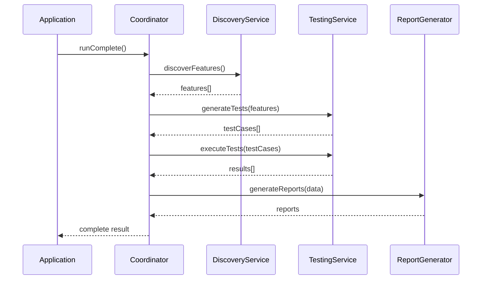

# 🏗️ System Architecture

## Overview

The UI Discovery System follows a modular, Single Responsibility Principle (SRP) architecture with clear separation of concerns.

## Architecture Diagram

```
┌─────────────────────────────────────────────────────┐
│                  Application Layer                   │
│         (Your Next.js/React/Vue/Angular App)        │
└──────────────────────┬──────────────────────────────┘
                       │
┌──────────────────────▼──────────────────────────────┐
│              Framework Adapter Layer                 │
│   ┌────────────┐  ┌────────────┐  ┌────────────┐  │
│   │ Playwright │  │ Puppeteer  │  │  Selenium  │  │
│   │  Adapter   │  │  Adapter   │  │  Adapter   │  │
│   └────────────┘  └────────────┘  └────────────┘  │
└──────────────────────┬──────────────────────────────┘
                       │
┌──────────────────────▼──────────────────────────────┐
│                 Coordinator Layer                    │
│         FeatureDiscoveryCoordinator                  │
│              (Orchestration Logic)                   │
└──────────────────────┬──────────────────────────────┘
                       │
┌──────────────────────▼──────────────────────────────┐
│                  Service Layer                       │
│  ┌──────────┐ ┌──────────┐ ┌──────────┐ ┌────────┐│
│  │Discovery │ │ Testing  │ │ Analysis │ │Report  ││
│  │ Service  │ │ Service  │ │ Service  │ │Service ││
│  └──────────┘ └──────────┘ └──────────┘ └────────┘│
└──────────────────────┬──────────────────────────────┘
                       │
┌──────────────────────▼──────────────────────────────┐
│              Discovery Modules Layer                 │
│ ┌────────┐ ┌────────┐ ┌────────┐ ┌────────────────┐│
│ │Button  │ │ Input  │ │Component│ │   Navigation   ││
│ │Discovery│ │Discovery│ │Discovery│ │   Discovery    ││
│ └────────┘ └────────┘ └────────┘ └────────────────┘│
└──────────────────────────────────────────────────────┘
```

## Core Components

### 1. Framework Adapter Layer

Provides abstraction over different browser automation tools:

- **IPageDriver Interface**: Common interface for all adapters
- **PlaywrightAdapter**: Playwright integration
- **PuppeteerAdapter**: Puppeteer integration
- **SeleniumAdapter**: Selenium integration (planned)

### 2. Coordinator Layer

**FeatureDiscoveryCoordinator**
- Orchestrates the discovery process
- Manages service lifecycle
- Coordinates parallel execution
- Handles configuration

### 3. Service Layer

Each service has a single responsibility:

**DiscoveryService**
- Coordinates feature discovery
- Manages discovery modules
- Aggregates results

**TestingService**
- Generates test cases
- Executes tests
- Collects results

**AnalysisService**
- Analyzes page structure
- Evaluates accessibility
- Generates metrics

**ReportGenerator**
- Creates JSON reports
- Generates HTML reports
- Produces Markdown documentation

### 4. Discovery Modules

Specialized modules for different UI elements:

**ButtonDiscovery**
- Finds all buttons
- Identifies click handlers
- Detects button states

**InputDiscovery**
- Discovers form inputs
- Identifies field types
- Detects validation

**ComponentDiscovery**
- Finds complex components
- Identifies panels and cards
- Discovers data tables

**NavigationDiscovery**
- Finds navigation elements
- Discovers links
- Identifies menus

## Data Flow



## Design Principles

### Single Responsibility Principle (SRP)
Each module has one clear responsibility:
- Discovery modules only discover
- Test service only tests
- Report generator only reports

### Open/Closed Principle
- Open for extension via new discovery modules
- Closed for modification of core interfaces

### Dependency Inversion
- Depends on abstractions (IPageDriver)
- Not on concrete implementations

### Interface Segregation
- Small, focused interfaces
- No unnecessary dependencies

## Performance Optimizations

### Parallel Discovery
- Multiple discovery modules run concurrently
- 67% faster than sequential execution

### Lazy Loading
- Services loaded only when needed
- Reduces initial memory footprint

### Caching
- Element queries cached
- Reduces redundant DOM operations

## Extensibility Points

### Custom Discovery Modules
```typescript
class CustomDiscovery extends BaseDiscovery {
  async discover(driver: IPageDriver) {
    // Custom discovery logic
  }
}
```

### Custom Adapters
```typescript
class CustomAdapter implements IPageDriver {
  // Implement interface methods
}
```

### Custom Report Formats
```typescript
class CustomReporter extends BaseReporter {
  async generate(data: DiscoveryResult) {
    // Custom report generation
  }
}
```

## Security Considerations

- No execution of page JavaScript by default
- Sandboxed test execution
- No storage of sensitive data
- Configurable timeout limits

## Next Steps

- [Technical Deep Dive](../technical/COMPLETE-GUIDE.md)
- [API Reference](../api/CORE.md)
- [Development Guide](../development/SETUP.md)